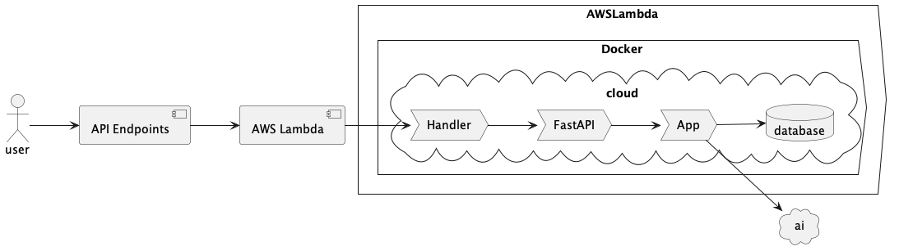
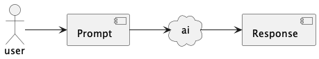
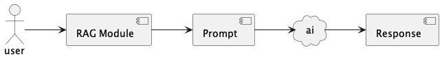
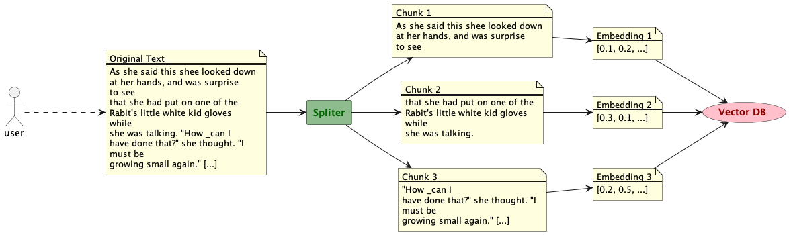
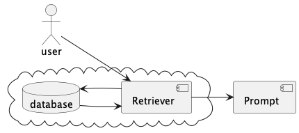

# POC RAG/AI App To AWS

## case study

Language models work by compressing vast amounts of world knowledge from books and documents into a single model through training. This process involves using text data to represent and store concepts, events, and theories within the model's weights. As a result, the model becomes a compressed version of this extensive information. While this has driven some of the biggest breakthroughs in AI, there are two key limitations to compressing knowledge in this way.

1. **Static Knowledge**: Language models, once trained, are static. They do not have real-time access to new or changing information. This means that a model can only reflect the data it was trained on up to a certain point in time, and it cannot update itself with new events, discoveries, or changes in knowledge unless retrained with fresh data. As a result, while a model may capture a broad range of knowledge up to a certain point, it can become outdated over time.
2. **Lack of Specialized Informatoin**: LLMs may provide general overviews but might not always have the depth needed in highly complex or nuanced fields, such as advanced scientific research, medical procedures, or intricate legal matters.

## LLC Limitations and Retrieval Augmented Generation (RAG)

To address these limitations, we can use a combination of techniques:

1. **Retrieval Augmented Generation (RAG)**: RAG is a technique that combines the power of language models with external data sources. It involves using a language model to generate a query, then retrieving relevant information from external sources, and finally, using the language model to generate a response based on the retrieved information. This approach allows for dynamic and up-to-date responses, as the model can access real-time information.
2. **Specialized Models**: For highly specialized fields, specialized models can be trained on specific domains or tasks. These models are trained on a large amount of data specific to their domain, allowing them to provide more specialized and accurate responses.

### The project

This project is a proof-of-concept for Retrieval-Augmented Generation (RAG) using AWS Bedrock, AWS DynamoDB, and Chroma. Chroma, an AI-native, open-source vector database, enhances developer productivity and simplifies running AI models locally. The system leverages AWS Bedrock for embeddings and language model processing, with LangChain Chroma serving as the vector database.

## Infrastructure Architecture

# [More UML documentation here at](https://plantuml.com/sequence-diagram)

- The UML diagram was created with a plugin called "PlanUML" which is a free for MS Code, PyCharm or intelliJ



## What is RAG?

Augmenting LLM with Specialize and mutable knowledge base


## How it works?

2 key elements: retriever and knowledge base




## Getting Started

### Configure AWS

You need to have an AWS account, and AWS CLI set up on your machine. You'll also need to have Bedrock enabled on AWS (and granted model access to Claude or whatever you want to use).

### Update .env File with AWS Credentials

Create a file named `.env` in `image/`. Do NOT commit the file to `.git`. The file should have content like this:

```
AWS_ACCESS_KEY_ID=XXXXX
AWS_SECRET_ACCESS_KEY=XXXXX
AWS_DEFAULT_REGION=us-east-1
TABLE_NAME=YourTableName
```

This will be used by Docker for when we want to test the image locally. The AWS keys are just your normal AWS credentials and region you want to run this in (even when running locally you will still need access to Bedrock LLM and to the DynamoDB table to write/read the data).

You'll also need a TABLE_NAME for the DynamoDB table for this to work (so you'll have to create that first).

### Installing Requirements

```sh
pip install -r image/requirements.txt
```

### Building the Vector DB

Put all the PDF source files you want into `image/src/data/source/`. Then go `image` and run:

```sh
# Use "--reset" if you want to overwrite an existing DB.
python populate_database.py --reset
```

### Running the App

```sh
# Execute from image/src directory
cd image/src
python rag_app/query_rag.py "how much does a landing page cost?"
```

Example output:

```text
Answer the question based on the above context: How much does a landing page cost to develop?

Response:  Based on the context provided, the cost for a landing page service offered by Galaxy Design Agency is $4,820. Specifically, under the "Our Services" section, it states "Landing Page for Small Businesses ($4,820)" when describing the landing page service. So the cost listed for a landing page is $4,820.
Sources: ['src/data/source/galaxy-design-client-guide.pdf:1:0', 'src/data/source/galaxy-design-client-guide.pdf:7:0', 'src/data/source/galaxy-design-client-guide.pdf:7:1']
```

### Starting FastAPI Server

```sh
# From image/src directory.
python app_api_handler.py
```

Then go to `http://0.0.0.0:8000/docs` to try it out.

#### Makefile

`Makefile` has some useful commands to help you work with the Django and Celery services.

```angular2html
build                          Build the docker image used by the 'web' and 'celery' services in the docker-compose.yml
build-no-cache                 Build the docker image, without the the docker build cache, used by the 'aws_rag_app' service in the docker-compose.yml
up                             Build the docker image used by the
'aws_rag_app' service in the docker-compose.yml
down                           shutdown the serviceaws_rag_app
```

## Build and Test the Image Locally

You'll need to run a few `Makefile` commands to get started. Run these commands in single terminal.

- `make build` - this will build the Docker images required to run the aws_rag_app service

### Build and Test the Image Locally

These commands can be run from `image/` directory to build, test, and serve the app locally.

This will build the image (using linux amd64 as the platform — we need this for `pysqlite3` for Chroma).

```sh
# Run the container using command `python app_work_handler.main`
make up
```

This will test the image, seeing if it can run the RAG/AI component with a hard-coded question (see ` app_work_handler.py`). But since it uses Bedrock as the embeddings and LLM platform, you will need an AWS account and have all the environment variables for your access set (`AWS_ACCESS_KEY_ID`, etc).

You will also need to have Bedrock's models enabled and granted for the region you are running this in.

## Testing Locally

After running the Docker container on localhost, you can access an interactive Swagger API page locally to test it: `http://0.0.0.0:8000/docs`.

```sh
curl -X 'POST' \
  'http://0.0.0.0:8000/submit_query' \
  -H 'accept: application/json' \
  -H 'Content-Type: application/json' \
  -d '{
  "query_text": "How much does a landing page for a small business cost?"
}'
```

## Deploy to AWS

I have put all the AWS CDK files into `rag-cdk-infra/`. Go into the folder and install the Node dependencies.

```sh
npm install
```

Then run this command to deploy it (assuming you have AWS CLI already set up, and AWS CDK already bootstrapped). I recommend deploying to `us-east-1` to start with (since all the AI models are there).

```sh
cdk deploy
```

## 🧪 Running Tests

This section describes how to set up and run tests for this project. We use [pytest](https://docs.pytest.org/en/7.1.x/) as the testing framework and [tox](https://tox.readthedocs.io/en/latest/) for managing multiple Python environments (if needed).

### Prerequisites

1. **Python Installation**: Ensure that Python (version `X.X.X` or above) is installed on your machine.

   - You can verify the installation by running:
     ```bash
     python --version
     ```
   - You can download the latest version of Python [here](https://www.python.org/downloads/).

2. **Virtual Environment**: It’s recommended to run tests inside a virtual environment to isolate dependencies.
   - Create a virtual environment:
     ```bash
     python -m venv venv
     ```
   - Activate the virtual environment:
     - **macOS/Linux**:
       ```bash
       source venv/bin/activate
       ```
     - **Windows**:
       ```bash
       .\venv\Scripts\activate
       ```

### Step 1: Install Dependencies

Before running the tests, make sure to install the required packages from the `requirements.txt` or `pyproject.toml` file:

```bash
pip install -r requirements.txt
# Or if using poetry:
poetry install
```

### Step 1a: Install Dependencies

You may also need to install additional testing dependencies, such as pytest, if they are not listed in your requirements file:

```bash
pip install pytest
```

### Step 2: Running Tests

You can run all the tests in the project using pytest. From the root of the project, execute the following command:

```bash
pytest
```

This will discover and run all the test cases in the tests/ directory.

### Additional pytest Options

- Run specific tests:
  This will discover and run all the test cases in the tests/ directory.

```bash
pytest path/to/test_file.py
```

- Run with detailed output:

```bash
pytest -v
```

- Run tests and display code coverage: Make sure to install pytest-cov:

```bash
pytest --cov=your_module tests/
```
